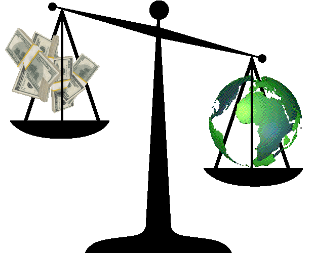

# Ethical Ransomware Manifesto

### Ⅰ. Precepts

The tactic of holding digital systems and data for ransom is not inherently unethical.

Ransomware can be deployed for purposes other than personal financial gain.

Ethical strategies for targeting systems based on user demographics can be utilized for social change.

### Ⅱ. Obfuscation & Redistribution

Mixers, coin tumblers, and stealth addresses can be used to obfuscate the movements of cryptocurrency before the final disbursement of captured funds.

The funds should be redistributed such that they apply a direct pressure that is inversely proportional to the desires of their targets.

### Ⅲ. Use Cases

The ultra wealthy can be compromised, their assets used to provide for the homeless or low-income families.

So-called "Men's Rights Activists" can be compromised, their assets used to fund women's rights organizations.

Climate change deniers can be compromised, their assets used to fund environmental protection organizations.

### Ⅳ. Determination

The selfish algorithm can be détourned.

---

[CC BY-NC-ND](https://creativecommons.org/licenses/by-nc-nd/4.0/legalcode) · [@Nullsleep](http://nullsleep.bsky.social) · 2017

---

Source for [ethicalransomware.net](http://ethicalransomware.net), deployed to S3 via GitHub Actions on push to `main`.
